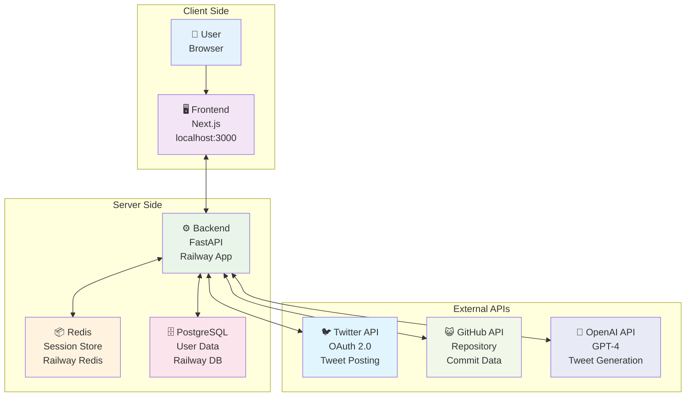
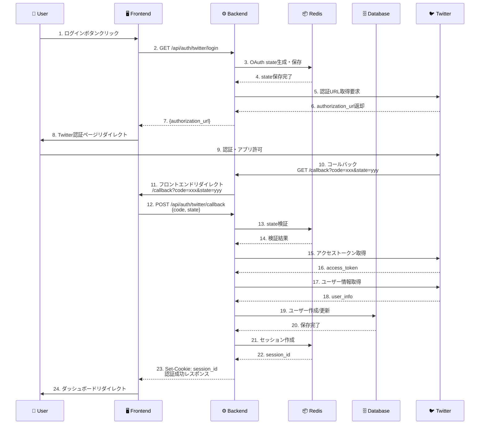
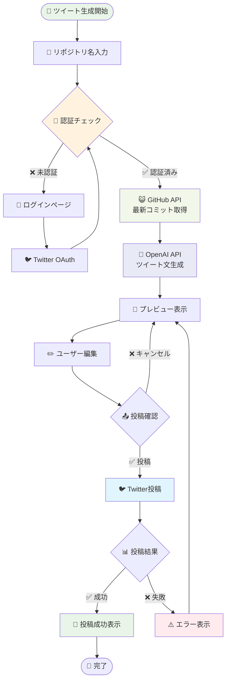
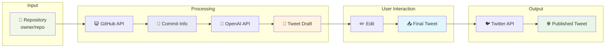
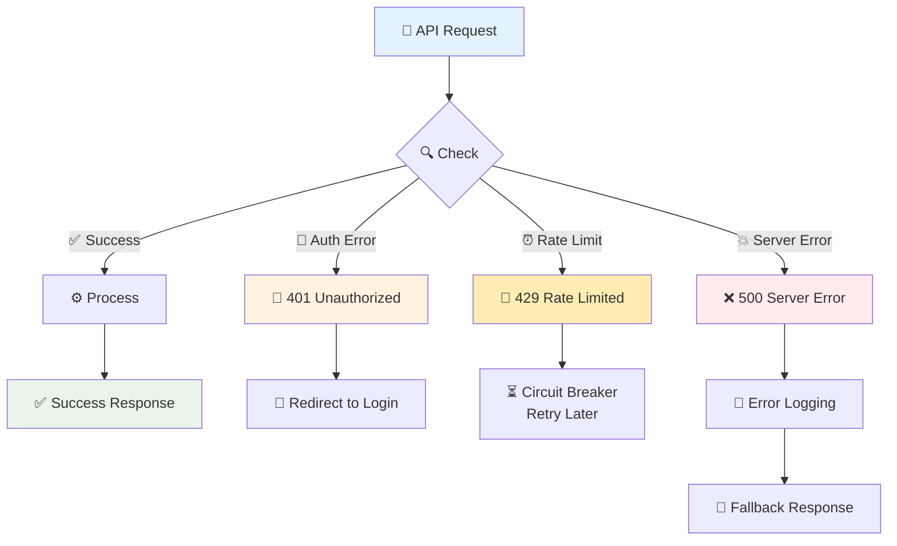

# 認証フロー（視覚的版）

## システム構成図



## 認証フロー詳細



## ツイート投稿フロー



## データフロー図



## エラーハンドリング



## セキュリティレイヤー

```
┌─────────────────────────────────────────────────────────┐
│                    🛡️ Security Layers                    │
├─────────────────────────────────────────────────────────┤
│ 🌐 HTTPS/TLS Encryption                                │
├─────────────────────────────────────────────────────────┤
│ 🚫 CORS Policy                                         │
│   • localhost:3000 (dev)                               │
│   • *.railway.app (prod)                               │
├─────────────────────────────────────────────────────────┤
│ ⏰ Rate Limiting                                        │
│   • OAuth: 30/min                                      │
│   • Tweet: 10/min                                      │
├─────────────────────────────────────────────────────────┤
│ 🔐 Session Management                                   │
│   • HttpOnly Cookies                                   │
│   • SameSite=None (prod)                               │
│   • Secure=True (prod)                                 │
├─────────────────────────────────────────────────────────┤
│ 🔒 Token Encryption                                     │
│   • AES-256 Encryption                                 │
│   • Database Storage                                    │
├─────────────────────────────────────────────────────────┤
│ 🔄 Circuit Breaker                                      │
│   • Auto-recovery                                      │
│   • Failure Threshold                                  │
└─────────────────────────────────────────────────────────┘
```
